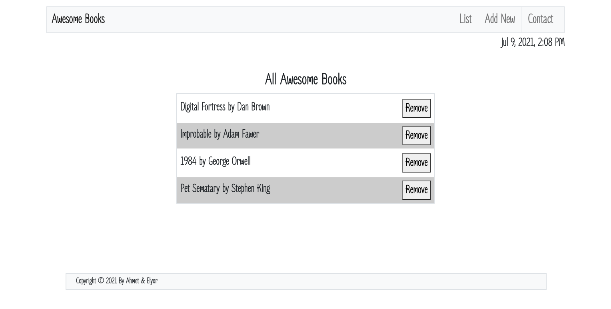
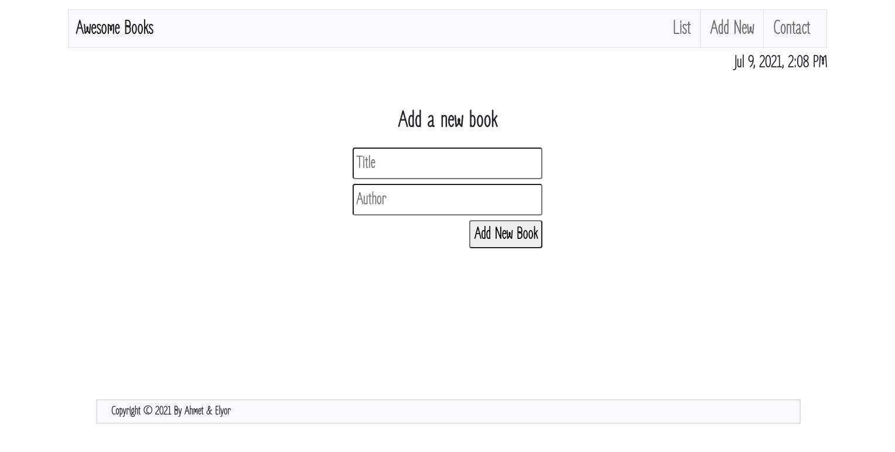
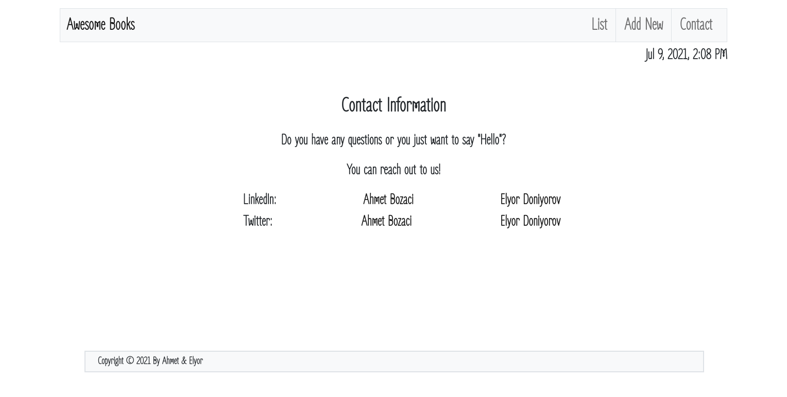

# Awesome Books

>Library website. User can add book with title and author and remove them.




## Built With

- Html
- Javascript

## Live Demo

[Awesome Books](https://ahmetbozaci.github.io/awesome-books/)

## Clone This Project
```
- $ git clone `$ https://github.com/ahmetbozaci/awesome-books.git`
- $ cd awesome-books
```

## Authors

👤 **Ahmet Bozacı**
- Github:[ahmtbozaci](https://github.com/ahmetbozaci)
- Twitter:[ahmtbozaci](https://twitter.com/ahmtbozaci)
- LinkedIn:[Ahmet Bozaci](https://www.linkedin.com/in/ahmetbozaci/)

👤 **Elyor Doniyorov**
- Github: [@elyor-doniyorov](https://github.com/elyor-doniyorov)
- LinkedIn: [@elyor-doniyorov](www.linkedin.com/in/elyor-doniyorov)


## 🤝 Contributing

Contributions, issues, and feature requests are welcome!

Feel free to check the [issues page](../../issues/).

## Show your support

Give a ⭐️ if you like this project!

## 📝 License

This project is [MIT](./LICENCE) licensed.
